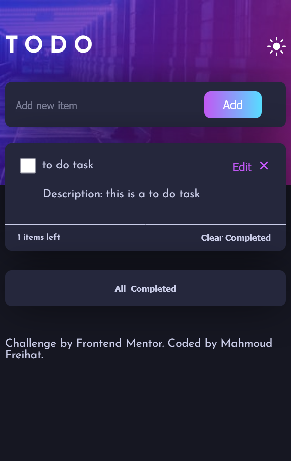

# Frontend Mentor - TO Do List page solution

This is a solution to the [TO Do List page challenge on Frontend Mentor](https://www.frontendmentor.io/challenges/todo-app-Su1_KokOW). Frontend Mentor challenges help you improve your coding skills by building realistic projects. 

## Table of contents

- [Overview](#overview)
  - [Screenshot](#screenshot)
  - [Links](#links)
  - [Built with](#built-with)

## Overview
In this project, I created a to do list page using HTML , CSS and JavaScript. The page layout is responsive and adjusts seamlessly to different screen sizes.

![]
### Screenshot

### Links

- Solution URL: (https://github.com/mahmood100100/to-do-list)
- Live Site URL:( https://mahmood100100.github.io/to-do-list/)

### Built with

- Semantic HTML5 markup
- CSS custom properties
- Flexbox
- Media queries for responsive design
- DOM Manipulation with JavaScript ES6
- Event Handling
- Local Storage
